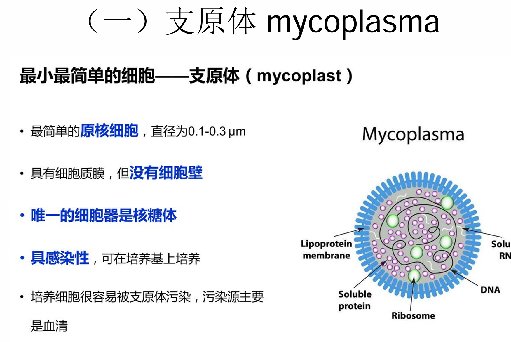

1.如何理解

一切有机体都由细胞构成，细胞是构成有机体的基本单位

细胞是代谢与功能的基本单位

细胞是有机体生长发育的基础

细胞是繁殖的基本单位，是遗传的桥梁

细胞是生命起源的标志，是生物演化的起点

支原体：最简单的原核细胞，有细胞膜，无细胞壁，有核糖体，具备感染性

培养细胞很容易被支原体感染，污染源主要是血清

病毒个体微小，20-200nm通常用电子显微镜才能看到

核酸种类多样，通常由dna或rna构成，只由一种核酸构成，不会存在两种的情况

寄生性，只有依赖宿主细胞才能存活，体内没有细胞器，只有依赖宿主的核糖体才能传递遗传物质，实现繁殖

病毒通过复制和装配的方式进行繁殖

细胞：选择性的膜结构，有核糖体，有染色质

自我繁殖，新陈代谢，运动性

双链+-dna +rna 蛋白质

dr 

ddr

rr

rrr

rr

rddr

真核生物有复杂的膜系统，在细胞质中有膜包被的细胞器，可以使各项功能的分工更明确，核仁的存在使基因从单链环状进化为双链链状，可以储存更多基因，大约2-3万个，内含子的出现使得细胞能根据需要剪切基因，从而转录出更多种类的蛋白质，有丝分裂器的出现使得真核生物遗传信息的传递过程更为复杂，在进化的过程中，真核生物和原核生物也形成了互利共生的关系，人肠道就生活着大量的菌群，但原核生物也同时可能是真核生物的病原体。

线粒体内膜折叠形成脊，大大增加了膜的表面积，为生物的生理活动提供场所，使得电子传递链和ATP酶有更多的附着位点，提高了能量产生效率，为细胞的生命活动提供重要支柱

1665年，虎克发现细胞

生物体结构和功能的基本单位是细胞

实验细胞学：以各种实验手段研究细胞的代谢过程和生理功能

细胞学说的建立诞生于19世纪

