### c#


有自动空行，无自动空行

写一个键即可，写一行东西按enter才行


num

默认是double类型，加了float才告诉计算机是浮点数

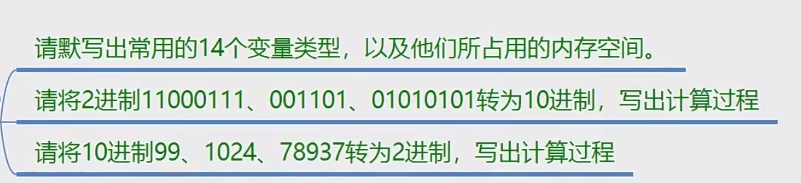

sbyte 1

int 4

short 2

long8

byte 1

uint 4

ushort2

ulong 8

float 4

double 8

decimal 16

bool1

char2

string打不出来


myAge

myGenfer

myAttact

myOffend

yourHeight

yourWeight


不可以修改

必须初始化
```
\\
\"
\'
\n
\t
```


大范围转小范围，int转long


啊啊


0100 1100

0101 0101

0101 1101

93


560                               110 0011    

​                                      010 0001

​                                      100 0010    66

0100 0010

33


异或 ^ 相同为0，不同为1

位取反~ 0变1，1变0


```
// See https://aka.ms/new-console-template for more information

// Console.WriteLine("变量");

// #region 声明变量
// Console.WriteLine("myregion");
// int i = 1;
//
//
// #endregion

string m = "练习";
Console.WriteLine(m);


// string name = "Alice";
// int age = 19;
// bool sex = true;//女
// float tall = 191.5f;
// float weight = 30.5f;
// string place = "闵行区";
// Console.WriteLine(name+" "+age+sex+tall+weight+place);

// int math = 80;
// int yuwen = 78;
// int english = 98;
// Console.WriteLine("小明的数学是"+math+"分");
// Console.WriteLine("小明的语文是"+yuwen+"分");
// Console.WriteLine("小明的英语是"+english+"分");
// Console.Write("我是小明\n我今年18\n我的爱好是制作游戏\n我要好好学习，天天向上");
// Console.WriteLine();
// Console.Write(@"我是小明
// 我今年18
// 我的爱好是制作游戏
// 我要好好学习，天天向上");

// char name1 = 'i';
// char name2 = '8';
// char name3 = '=';
// float name4 = name1;
// float name5 = name2;
// float name6 = name3;
// Console.Write(name4);
// Console.WriteLine();
// Console.Write(name5);
// Console.WriteLine();
// Console.Write(name6);
// Console.WriteLine();
//括号转换，parse,convert,toString
// 括号强转：数值整形之前转换，低精度转高精度
//parse:字符串转对应类型 变量类型.Prase（字符串）
//
//
// Console.WriteLine(sbyte.Parse("1"));
//
// int a = Convert.ToInt32("12");
// Console.WriteLine(a);
// abc = true.ToString()
// long l =1;
// short i =(short)l;
// Console.WriteLine(24069.ToString());

// char cd = (char)24069;
// Console.WriteLine(cd);
//
// Console.WriteLine("shuRu YuWen");
// string a = Console.ReadLine();
// long a1 = long.Parse(a);
// Console.WriteLine("Math");
// string b = Console.ReadLine();
// long b1 = long.Parse(b);
// Console.WriteLine("English");
// string c = Console.ReadLine();
// long c1 = long.Parse(c);

// Console.WriteLine("请输入一个数字");
// try
// {
//     int a = int.Parse(Console.ReadLine());
// }
// catch
// {
//     Console.WriteLine("输入错误");
// }
//
//
//
// Console.WriteLine("请输入成绩");
// try
// {
//     int a = int.Parse(Console.ReadLine());
// }
// catch
// {
//     Console.WriteLine("输入错误");
// }
// int age = 19;
// Console.WriteLine(age+10);
// int r = 5;
// Console.WriteLine(Double.Pi*(r^2));
// Console.WriteLine(2*Double.Pi*r);
// int a = 100, b = 69, c = 80;
// Console.WriteLine((a+b+c)/3);
// const float price = 285;
// const float trousers = 720;
// Console.WriteLine(price*2+trousers*3);
// Console.WriteLine((price*2+trousers*3)*0.38);

//31
//30
//42
// int a = 10, b = 20;
// int num = a++ + ++b + a++;
// Console.WriteLine(num);

// int a = 99, b = 89;
// int c = a;
// a = b;
// b = c;
// Console.WriteLine(a);
// Console.WriteLine(b);
// const int a = 24*60*60;
// const int b = 60*60;
// const int c = 60;
// const float time = 987652;
// int sec=(int)(time % c);
// int min = (int)time %b/c;
// int hour = (int)time %a/b;
//
// int day = (int)time / a;
// Console.WriteLine(day+"_"+sec+"_"+min+"_"+hour);
// const string name = "alice";
// Console.WriteLine("你好"+name);

// string name = "alice";
// int age = 33;
// string email = "alice@gmail.com";
// string address = "123 Main Street";
// int preferSalary = 100;
// Console.WriteLine("姓名{0}，年龄{1}，邮箱{2}，家庭住址{3}，期望工资{4}",name,age,email,address,preferSalary);


// Console.WriteLine("输入用户名");
// string name =  Console.ReadLine();
// Console.WriteLine("输入年龄");
// string age =  Console.ReadLine();
// Console.WriteLine("输入班级");
// string classnumber =  Console.ReadLine();
// Console.WriteLine("用户名{0}，年龄{1}，班级{2}", name, age, classnumber);
//

// int a = 20, b = 10;
// Console.WriteLine(a>b?a:b);
// string a = Console.ReadLine();
// Console.WriteLine(a=="帅哥"?a:"美女");

// Console.WriteLine("name");
// string n = Console.ReadLine();
// Console.WriteLine("c#");
// int q = int.Parse(Console.ReadLine());
// Console.WriteLine("unity");
// int y = int.Parse(Console.ReadLine());
// Console.WriteLine(q >= 90&& y >= 90?"毕业":"延毕");

// Console.WriteLine("输入一个年份");
// int q = int.Parse(Console.ReadLine());
// Console.WriteLine(q %400==0||q%4==0&&q%100!=0);

// Console.WriteLine("今天看唐老师视频花了多少分钟？");
// try
// {
//     int q = int.Parse(Console.ReadLine());
//     if (q > 60)
//     {
//       Console.WriteLine("今天看视频花了{0}分钟，看来你离成功又进了一步！",q);
//     }
//     else
//     {
//         Console.WriteLine("你还需要努力啊！");
//     }
// }
// catch
// {
//     Console.WriteLine("请输入正确的时间");
// }


// Console.WriteLine("你的语文成绩是多少分？");
// try
// {
//     int q = int.Parse(Console.ReadLine());
//     Console.WriteLine("你的数学成绩是多少分？");
//     int w = int.Parse(Console.ReadLine());
//     Console.WriteLine("你的英语成绩是多少分？");
//     int e = int.Parse(Console.ReadLine());
//     if (q > 70 && w > 80 && e > 90)
//     {
//         Console.WriteLine("非常棒，继续加油");
//     }
//     else if (q == 100 || w == 100 || e == 100)
//     {
//         Console.WriteLine("非常棒，继续加油");
//     }
//     else if (q > 90 && (w > 70 || e > 70))
//     {
//         Console.WriteLine("非常棒，继续加油");
//     }
// }
// catch
// {
//     Console.WriteLine("格式错误");
// }


// float testscore = 91;
// if (testscore >= 90)
// {
//     Console.WriteLine("爸爸奖励100元");
// }
// else
// {
//     Console.WriteLine("一个月不能玩游戏");
// }

// try
// {
//     Console.WriteLine("请输入一个数a");
//     int a = int.Parse(Console.ReadLine());
//     Console.WriteLine("请输入一个数b");
//     int b = int.Parse(Console.ReadLine());
//     if (a % b == 0 || b % a == 0|| a + b > 100)
//     {
//         Console.WriteLine(a);
//     }
//     else
//     {
//         Console.WriteLine(b);
//     }
// }
// catch
// {
//     Console.WriteLine("格式错误");
// }

// try
// {
//     Console.WriteLine("输入一个整数");
//     int a = int.Parse(Console.ReadLine());
//     if (a % 2 == 0)
//     {
//         Console.WriteLine("Your number is even");
//     }
//     else
//     {
//         Console.WriteLine("Your number is odd");
//     }
// }
// catch
// {
//     Console.WriteLine("格式错误");
// }


// int a =20,b=3,c=5;
// int max =0;
// if (a > b)
// {
//     max = a;
// }
// else
// {
//     max = b;
// }
//
// if (max>c)
// {
//     
// }
// else
// {
//     max = c;
// }
// Console.WriteLine(max);


// Console.WriteLine("请输入一个数字");
//
// try
// {   
//     char a = Console.ReadKey().KeyChar;
//     if (a == 0 || a == 1 || a == 2 || a == 3 || a == 4 || a == 5 || a == 6 || a == 7 || a == 8 || a == 9)
//     {
//         Console.WriteLine("您输入了一个数字");
//     }
//     else
//     {
//         Console.WriteLine("这不是一个数字");
//     }
// }
// catch
// {
//     Console.WriteLine("这不是一个数字");
// }

// Console.WriteLine("输入用户名");
// string a =Console.ReadLine();
// Console.WriteLine("输入密码");
// int b = int.Parse(Console.ReadLine());
// if (a == "admin" && b == 8888)
// {
//     Console.WriteLine("密码正确，成功登录");
// }
// else
// {
//     if(a != "admin"){
//       
//           Console.WriteLine("用户不存在");
//     }
//     else
//     {
//         Console.WriteLine("密码错误");
//     }
// }
    


// Console.WriteLine("输入年龄");
// int a = int.Parse(Console.ReadLine());
// if (a >= 18)
// {
//     Console.WriteLine("可以查看");
// }else if (a < 13)
// {
//     Console.WriteLine("不能查看");
// }else if (a >= 13 && a < 18)
// {
//     Console.WriteLine("是否继续查看（yes/no）");
//     string b = Console.ReadLine();
//     if (b == "yes")
//     {
//         Console.WriteLine("请查看");
//     }
//     else
//     {
//         Console.WriteLine("退出");
//     }
// }

// int salary = 4000;
//
// Console.WriteLine("请输入王老师课程评价");
// string answer=Console.ReadLine();
// switch (answer)
// {
//     case "很兴奋":
//         Console.WriteLine("评定为{0}级，工资为{1}","A",4000+500);
//         break;
//     case "很充实":
//         Console.WriteLine("评定为{0}级，工资为{1}","B",4000);
//         break;
//     case "还好吧":
//         Console.WriteLine("评定为{0}级，工资为{1}","C",4000-300);
//         break;
//     case "难理解":
//         Console.WriteLine("评定为{0}级，工资为{1}","D",4000-500);
//         break;
//     case "枯燥无味":
//         Console.WriteLine("评定为{0}级，工资为{1}","E",4000-800);
//         break;
//     default:
//         Console.WriteLine("格式错误");
//         break;
// }

// int money = 10;
//
// Console.WriteLine("购买型号");
// string answer=Console.ReadLine();
// switch (answer)
// {
//     case "中杯":
//         Console.WriteLine("购买成功，你还剩5元");
//         break;
//     case "大杯":
//         Console.WriteLine("购买成功，你还剩3元");
//         break;
//     case "超大杯":
//         Console.WriteLine("钱不够，请换其他型号");
//         break;
//     
//     default:
//         Console.WriteLine("格式错误");
//         break;
// }

// int i = 0;
// while (i<20)
// {
//     ++i;
//     if(i%2==0)
//     {
//         continue;
//         
//     }
//     Console.WriteLine(i);
// }


// int i = 0;
// while (i < 100)
// {
//     i++;
//     Console.WriteLine(i);
// }

// int i = 0;
// int j = 0;
// while (i < 100)
// {
//     i++;
//     j += i;
//     
// }
// Console.WriteLine(j);

// int i = 0;
// int j = 0;
// while (i < 100)
// {
//     i++;
//     if (i % 7 == 0)
//     {
//         continue;
//     }
//     j += i;
//     
// }
// Console.WriteLine(j);

// try
// {
//     Console.WriteLine("请输入一个数");
//     int num = int.Parse(Console.ReadLine());
//     int index = 2;
//     while (index < num)
//     {
//         if (num % index == 0)
//         {
//             
//             break;
//         }
//         index++;
//     }
//     if(index!=num){Console.WriteLine("不是质数");}
//     else
//     {
//         Console.WriteLine("是质数");
//     }
//
//
// }
// catch
// {
//     Console.WriteLine("格式错误");
// }

// try
// {
//     Console.WriteLine("请输入用户名和密码");
//     while (true)
//     {
//         string name = Console.ReadLine();
//         int password = Convert.ToInt32(Console.ReadLine());
//         if (name=="admin"&& password==8888)
//         {
//             Console.WriteLine("输入正确");
//             break;
//         }
//         else
//         {
//             Console.WriteLine("重新输入");
//         }
//     }
// }catch{
//     Console.WriteLine("格式错误");
// }

// try
// {
//     Console.WriteLine("输入班级人数");
//     int number = Convert.ToInt32(Console.ReadLine());
//     int i = 1;
//     int j = 0;
//     int k = 0;
//     while (i<=number)
//     {
//         Console.WriteLine("请输入第{0}个人的成绩",i);
//         int number2 = Convert.ToInt32(Console.ReadLine());
//         j += number2;
//         i++;
//     }
//
//     k = j / (i-1);
//     Console.WriteLine("平均成绩为{0}，总成绩为{1}",k,j);
// }
// catch
// {
//     Console.WriteLine("格式错误");
// }

// int sum = 0;
// int i = 0;
// while (sum<500)
// {
//     sum += i;
//     i++;
//     
// }
//
// i--;
// Console.WriteLine("加到第{0}个数字就可以使sum>500",i);

// double num =100;
//
// float i = 1f;
// while (num < 1000)
// {
//     num *= 1.2;
//     i++;
// }
//
// i--;
// Console.WriteLine("经过{0}个月，观看视频人数达到1000人",i);

// int i =1;
// int a = 1, b = 1;
// while (i < 19)
// {
//     int c = b;
//     b = b + a;
//     a = c;
//     i++;
// }
// Console.WriteLine(b);//6765

// int num = 2;
// while (num <= 100)
// {
//     int index = 2;
//     while (index < num)
//     {
//         if (num % index == 0)
//         {
//             break;
//         }
//         
//             
//
//         index++;
//     }
//
//     if (index == num)
//     {
//         Console.WriteLine(num);
//     }
//     num++;
// }

// do
// {
//     Console.WriteLine("请输入用户名和密码");
//     string n = Console.ReadLine();
//     string q=Console.ReadLine();
//     if (n == "admin" || q == "8888")
//     {
//         Console.WriteLine("密码正确");
//         break;
//     }
//     Console.WriteLine("error");
//     
// }while(true);

// do
// {
//     Console.WriteLine("请输入你的姓名");
//     string n = Console.ReadLine();
//     if (n == "q")
//     {
//         break;
//     }
// }while(true);

// for (int i = 1; i <= 100; i++)
// {
//     Console.WriteLine(i);
// }

// int sum = 0;
// for (int i = 0; i < 101; i+=2)
// {
//     sum += i;
// }
// Console.WriteLine(sum);//2550

// for (int i = 100; i < 1000; i++)
// {
//
//     if ( Math.Pow(i / 100, 3)+ Math.Pow(i / 10 % 10, 3) + Math.Pow(i % 10, 3) == i)
//     {
//         Console.WriteLine(i);
//     }
// }

// for (int i = 1; i < 10; i++)
// {
//     for (int j = 1; j <= i; j++)
//     {
//         Console.Write("{0}*{1}={2}  ",j,i,i*j);
//     }
//     Console.WriteLine();
// }


// for (int i = 1; i <= 10; i++)
// {
//     for (int j = 1; j <= 10; j++)
//     {
//         if (1 < j && j < 10 && 1 < i && i < 10)
//         {
//             Console.Write(" ");
//         }
//         else
//         {
//             Console.Write("*");
//         }
//     }
//
//     Console.WriteLine();
// }

// for (int i = 0; i < 10; i++)
// {
//     for (int j = 0; j < i; j++)
//     {
//         Console.Write("*");
//     }
//     Console.WriteLine();
// }

// for (int i = 0; i < 10; i++)
// {
//     for (int k = 0; k < 10 - i; k++)
//     {
//         Console.Write(" ");
//     }
//     for (int j = 0; j<i*2-1; j++)
//     {
//         Console.Write("*");
//     }
//     Console.WriteLine();
// }
```

```c#
 #region 知识点二 控制台其它方法
            //1.清空
            Console.Clear();

            //2.设置控制台大小
            // 窗口大小 缓冲区大小
            // 注意：
            //1.先设置窗口大小，再设置缓冲区大小
            //2.缓冲区的大小不能小于窗口的大小
            //3.窗口的大小不能大于控制台的最大尺寸
            //窗口大小
            Console.SetWindowSize(100, 50);
            //缓冲区大小 （可打印内容区域的宽高 ）
            Console.SetBufferSize(1000, 1000);

            //3.设置光标的位置
            //控制台左上角为原点0 0 右侧是X轴正方向 下方是Y轴正方向 它是一个平面二维坐标系
            //注意：
            //1.边界问题
            //2.横纵距离单位不同 1y = 2x 视觉上的
            Console.SetCursorPosition(10, 5);
            Console.WriteLine("123123");

            //4.设置颜色相关
            //文字颜色设置
            Console.ForegroundColor = ConsoleColor.Red;
            Console.WriteLine("123123123");
            Console.ForegroundColor = ConsoleColor.Green;
            //背景颜色设置
            //Console.BackgroundColor = ConsoleColor.White;
            //重置背景颜色过后 需要Clear一次 才能把整个背景颜色改变
            //Console.Clear();

            //5.光标显隐
            Console.CursorVisible = false;

            //6.关闭控制台
            Environment.Exit(0);
            #endregion
```


```
#region 知识点一 复习 输入输出
            //输出
            //Console.WriteLine("123123");//光标空行
            //Console.Write("123123123123");//不空行
            //输入
            //string str = Console.ReadLine();
            //如果在ReadKey(true)不会把输入的内容显示在控制台上
            //char c = Console.ReadKey(true).KeyChar;
            //Console.WriteLine(c);
            #endregion
```


ref一定要在外面初始化变量，内部不用

out一定要在内部修改参数，外面不用初始化

这两个功能一样，都可以在函数内部修改某值，外部也修改了。括号要写（ref 参数）或者（out 参数）


this是环境

是自己


代表自己


private 不能在外部访问，只能在内部访问

public可以在外部访问并初始化


`break` 和 `continue` 是用于控制循环结构的语句，常见于 `for` 和 `while` 循环中

值类型在函数内部更改其值后函数外面的值不变，引用类型在函数内部更改其值后函数外面的值变化


ref要不要加 引用类型不需要加，没有new相当于把地址copy了，两个地址指向同一个值

ref的规则，能不能有多个参数加ref，可以


if可以理解为任意一个


在while循环中实现如果0则变成红色

switch检测输入的是什么字符


控制不要超出范围，记得写break；


`break` 和 `continue` 是用于控制循环结构的语句，常见于 `for` 和 `while` 循环中

但是条件分支语句`switch`也有break；


aaaAaaa

AA

50,30

如果玩家1和玩家2输入最后一字不符，则返回输入结果错误

可以重新输入（不限次数）

如果玩家一10秒之内没有回复，则显示玩家1失败，再按任意键进入游戏结束界面


物体：机器人，机器，汽车，飞机，太阳，星星

生物：人，猫，张阿姨，隔壁老王，向日葵，菊花，荷花


private

public

protected 内部和子类使用

10,10,10,20

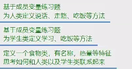

堆Heap


const一定要初始化才能使用，之后不能修改，一定要写在访问修饰符后面

const只能修饰变量，static可以修饰很多

都可以通过类名点出来使用


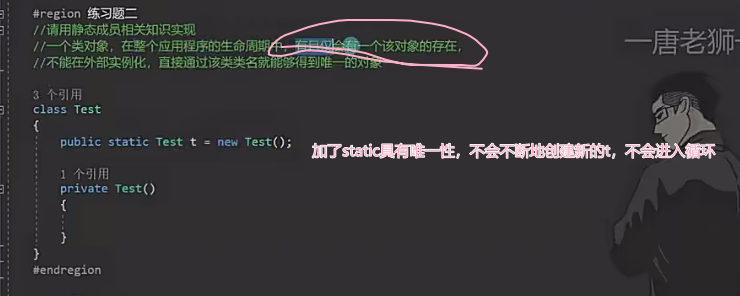


拓展方法：

两个static，this后面一定要加非静态的


可以写在非静态结构体中，静态结构体一般是工具


is:判断这个对象是不是指定类的对象，如果是则返回true，如果不是则返回false

as：假设原来这个对象是父类的对象，可以把这个对象转变成指定子类的对象，如果不是指定类的对象返回null


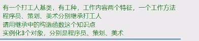


装箱：把值类型装进object中，存进堆

拆箱：把object中存储的引用类型再转换成值类型


多态：改变/添加

vob/抽象函数/接口


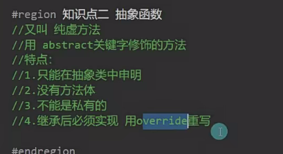


using可以引用命名空间，这样要用其中的类可以直接用


equal->如果是值类型,直接比较两个值是否相等

如果是引用类型则比较地址是否相同

referencesEquals主要比较引用类型的对象

值类型始终返回flase

object.可以不写


gettype和反射相关

克隆体中的值类型在改变后不会改变原有类型

克隆体中的引用类型在改变后会改变原有的引用类型


怎么克隆？会得到object类的它自己


通过函数包裹实现在外部使用受保护的方法

equals的虚方法：默认相当于refenceEquals

但是微软重写了该方法，因此外部可访问的静态方法equals可以比较值是否相等


虚方法都可以重写

这三个都可以应用于重写

gethashcode：获得对象的哈希码，不同对象的哈希码可能相同

用于返回当前对象代表的字符串


可以打印出类似“来源”的东西 会得到一个类自己的字符串


string.Format（）是字符串拼接，可以拼接字符串

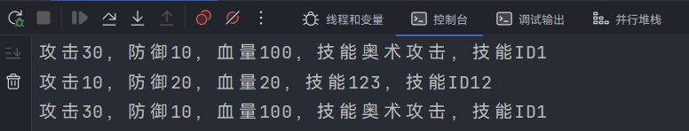

string也可以不变


split replace


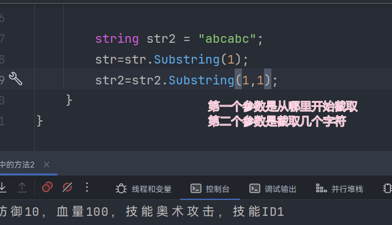


stringbuilder会事先开辟一个房间，超过了会自动扩容，可以防止程序卡顿，减少垃圾的产生

多用stringbuilder


成语接龙

首先用户先输入一个成语，用户再回答一个对应拼音的成语

系统检测是否成功完成，如果十秒内成功完成则


arraylist增删查改的api都帮我们封装好了，而数组还要通过搬家和遍历的方式才能实现增删查改，arraylist可以装任何类型的变量


arrlist可以批量增加，但是栈只能一个个的放


先进后出，就和图书馆放了一堆书拿书一样，从上面拿，再从上面放

队列：滑滑梯，先滑下去的先出来，进去顺序和出来顺序一致


先进先出

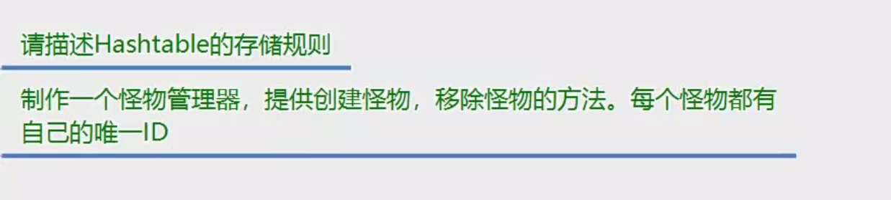

用键值对的方法存储

类型是object


可以自定义类型，防止装箱拆箱的出现

list内部是一个泛型数组

arraylist内部封装的是object数组


## 字典


## 数据结构，链表


数组，栈，队列，链表，树，图，堆，散列表（hashTable）

顺序存储：地址一个个挨着的，按照从前向后的顺序存储

链式存储：地址不是挨着的，前一个元素中存着后一个元素的信息（如果是单向链表），如果是双向链表，则后一个元素存储两头的信息

在增删查改方面有优先级

增加，链表更方便

删除，链表更方便，不用搬家

查找，顺序存储更方便，因为可以直接用下标，不用while遍历

改，顺序存储更方便，可以直接用下标，不用遍历


## LinkList


## 交错数组


## 泛型栈和队列


数组，固定不变的一串数据，顺序存储

list，可以自动延伸的顺序存储的数组，方便查找

linkedlist链表，链式存储，存储方式不同，方便添加和修改

------

stack：先进后出，存和取是相反的（ui面板的显隐规则）

queue：先进先出，存取相同（消息队列）

-----

dictionary字典，可以自己指定类型的哈希表（有对应数据关系的数据内容）


## 委托中函数的删除


委托：一个装函数的容器

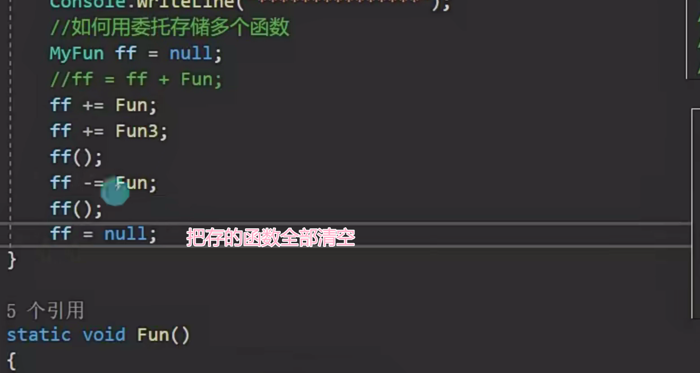


先判断是否是空再调用


Action是无参无返回值的委托

静态函数中不能使用非静态方法或成员

## 静态成员


## 委托练习题


## 委托和事件的区别


事件不能在外部赋值

只是委托更安全的一种委托的方法，写的位置，是否赋值，怎么调用，和委托有所区别，其他都差不多


但是可以加


只要出现等于就不能使用

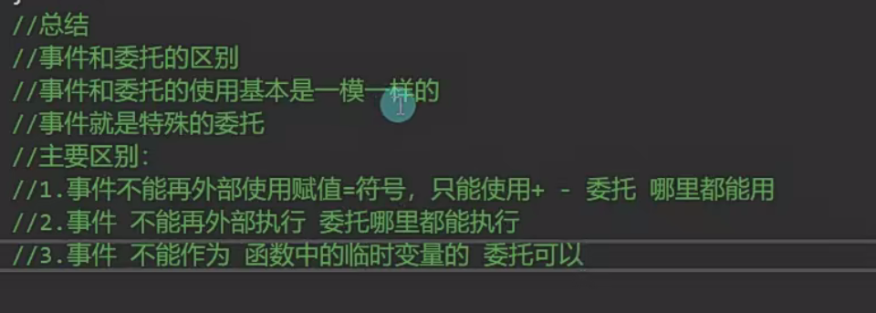


## 匿名函数


## 那么大表达式


## 格式化


## list排序


1. 47
2. 82
3. 13
4. 65
5. 98
6. 24
7. 56
8. 3
9. 77
10. 42
11. 89
12. 19
13. 61
14. 33
15. 91
16. 28
17. 54
18. 1
19. 76
20. 44
21. 85
22. 12
23. 68
24. 30
25. 99
26. 23
27. 50
28. 17
29. 72
30. 49


1. 14  92  87  76  35  45  67  23  89  12
2. 56  78  34  65  19  82  47  91  28  53
3. 71  39  58  27  64  15  86  42  97  11

好的！以下是按照“类型”、“品类”和“名字”三个标签整理的表格，包含10个随机物品：

| 类型 | 品类     | 名字           |
| ---- | -------- | -------------- |
| 水果 | 食物     | 西红柿         |
| 家电 | 电器     | 电磁炉         |
| 动物 | 哺乳动物 | 非洲象         |
| 文学 | 书籍     | 《百年孤独》   |
| 机械 | 交通工具 | 超级跑车       |
| 零食 | 食品     | 巧克力夹心饼干 |
| 数码 | 电子产品 | 无线蓝牙耳机   |
| 服饰 | 服装     | 防风防水冲锋衣 |
| 艺术 | 乐器     | 大提琴         |
| 护肤 | 化妆品   | 多效修护精华液 |

如果需要调整或补充，请随时告诉我！

好的！以下是按照你要求的格式，用双引号和逗号分隔的10个物品信息：

1. "水果","食物","西红柿"  
2. "家电","电器","电磁炉"  
3. "动物","哺乳动物","非洲象"  
4. "文学","书籍","百年孤独"  
5. "机械","交通工具","超级跑车"  
6. "零食","食品","巧克力夹心饼干"  
7. "数码","电子产品","无线蓝牙耳机"  
8. "服饰","服装","防风防水冲锋衣"  
9. "艺术","乐器","大提琴"  
10. "护肤","化妆品","多效修护精华液"  

如果还需要调整，请随时告诉我！


协变：out

逆变：in

可以用于指定修饰接口和委托中的泛型

用于确定泛型是返回值还是参数


## 预处理器指令


if define undef error warning

## 反射

获得所有成员：member

获得变量：field

获得方法：method

type：得到类的各种信息

assembly：得到程序集进而得到程序集中的各种信息，包括type

activator：得到类后快速实例化对象


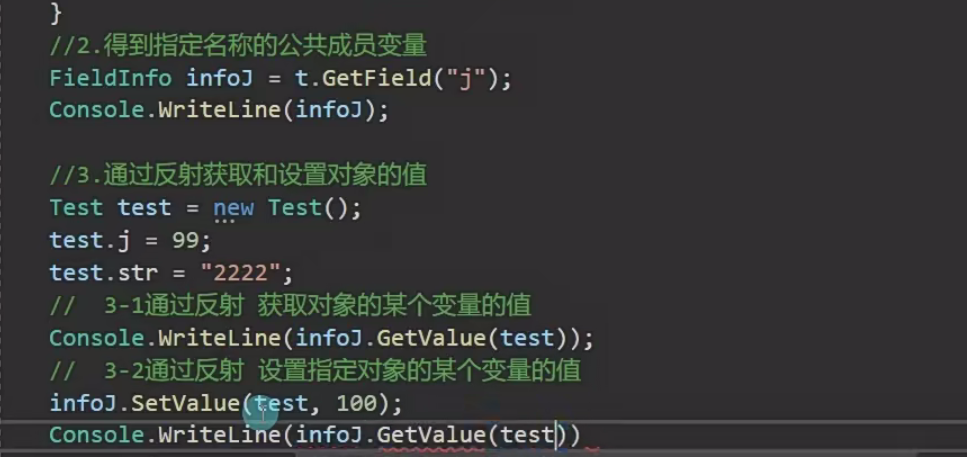


## 迭代器


## 俄罗斯方块


## ref/out

函数传参不加ref/out值不变，new一个引用，引用不变，没有new引用，引用改变

因为改的相当于是参数的值,而不是原来的值

加了ref/out才能改变值或者把new出来的传进去

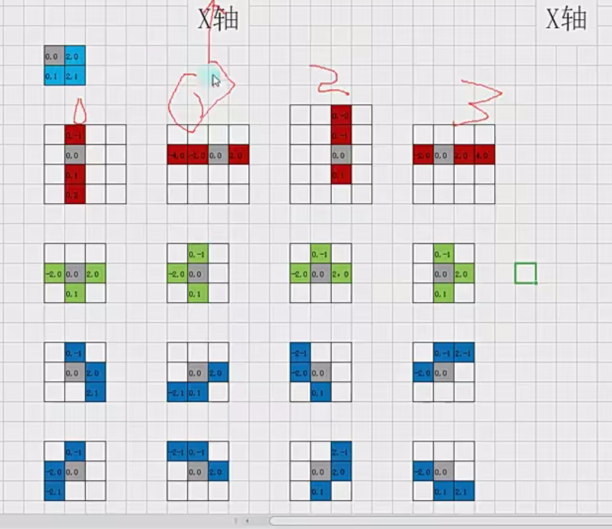


generic泛型


因为引擎帮我们new好了

因为引擎没帮我们new


人生在世总要信一些宗教的

# unity

## time

time可以用来计算跑动的速度

计算时间


## position


相对父对象的坐标


localposition

## 对象当前的各朝向


世界当前的各朝向：vector3.forward


## 检测鼠标输入

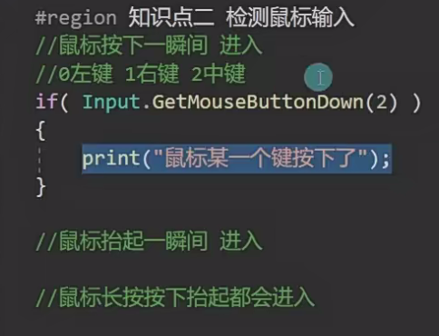


## camera


有相对距离相对位置的时候才用本地坐标（localposition）

如果没有相对位置的要求，那么则用世界坐标


添加力rigidbody.addforce

rigidbody.addrelativeforce

添加速度rigidbody.velocity=vector3.forward*10;

改变transform中的position

用transform中的translate api

## 音频


## 面板的显隐


