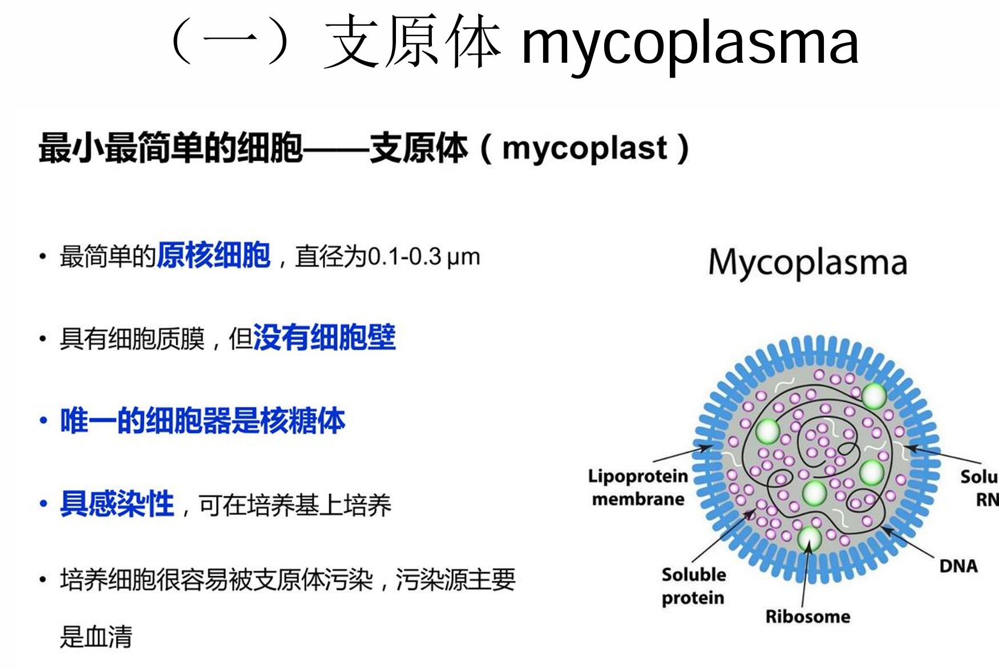
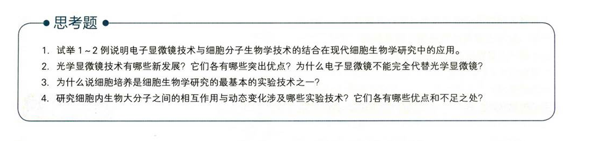

# 细胞生物学

一切有机体都由细胞构成，细胞是构成有机体的基本单位

细胞是代谢与功能的基本单位

细胞是有机体生长发育的基础

细胞是繁殖的基本单位，是遗传的桥梁

细胞是生命起源的标志，是生物演化的起点

支原体：最简单的原核细胞，有细胞膜，无细胞壁，有核糖体，具备感染性

培养细胞很容易被支原体感染，污染源主要是血清

病毒个体微小，20-200nm通常用电子显微镜才能看到

核酸种类多样，通常由dna或rna构成，只由一种核酸构成，不会存在两种的情况

寄生性，只有依赖宿主细胞才能存活，体内没有细胞器，只有依赖宿主的核糖体才能传递遗传物质，实现繁殖

病毒通过复制和装配的方式进行繁殖

细胞：选择性的膜结构，有核糖体，有染色质

自我繁殖，新陈代谢，运动性

双链+-dna +rna 蛋白质

dr 

ddr

rr

rrr

rr

rddr

真核生物有复杂的膜系统，在细胞质中有膜包被的细胞器，可以使各项功能的分工更明确，核仁的存在使基因从单链环状进化为双链链状，可以储存更多基因，大约2-3万个，内含子的出现使得细胞能根据需要剪切基因，从而转录出更多种类的蛋白质，有丝分裂器的出现使得真核生物遗传信息的传递过程更为复杂，在进化的过程中，真核生物和原核生物也形成了互利共生的关系，人肠道就生活着大量的菌群，但原核生物也同时可能是真核生物的病原体。

线粒体内膜折叠形成脊，大大增加了膜的表面积，为生物的生理活动提供场所，使得电子传递链和ATP酶有更多的附着位点，提高了能量产生效率，为细胞的生命活动提供重要支柱

1665年，虎克发现细胞

生物体结构和功能的基本单位是细胞

实验细胞学：以各种实验手段研究细胞的代谢过程和生理功能

细胞学说的建立诞生于19世纪

透射电子显微镜：观察细胞超微结构

扫描电子显微镜：观察细胞表面样貌

通过连续切片，电子断层扫描，可以实现样本高分辨率3d表征，帮助阐明结构功能关系

可以看清细胞的动态功能：比如微管和细胞器的相互作用

结合荧光标记技术和电子显微镜技术，可以追踪蛋白质在细胞内的动态变化

因此可以揭示细胞信号传导的分子机制

比如观察pcna蛋白在dna复制期的动态变化

FIB-SEM技术结合活细胞成像，可以研究巨噬细胞对病原体的应答机制

体电子显微学技术可以用于构建细胞的三维图谱

研究细胞间的相互作用和组织结构

可以用于药物筛选和疾病机制研究

2.TIRFM，PALM/STORM,4$\pi$和STED显微术,SIM

电子显微镜目前还不能观察活的生物制品,并且难以观察细胞的全貌,所以很多领域都需要光镜和电镜结合

3.干细胞生物学的发展及其应用很大程度上基于细胞培养技术的发展

4.荧光漂白恢复技术

酵母双杂交技术

荧光共振能量转移技术

放射自显影技术

## 细胞生物学研究方法

分辨率:能区分开两个质点间的最小距离

普通光学显微镜最大分辨率0.2$\mu$m

细胞培养:从活体组织分离出特定细胞,在一定条件下进行培养,使之能继续生存,生长以致繁殖的一种方法

原代培养:直接从生物体获取细胞进行培养

传代培养:将原代培养的细胞连续以一定比例扩大培养

细胞系:原代培养细胞成功传代

等电凝胶电泳:在丙烯酰胺凝胶两端形成电场,使含有不同等电点的两性电解质在电场中形成ph梯度,样品中所有蛋白质在电泳时都向自己的等电点处移动,最后静止于各自的等电点

## 细胞膜

脂质体：脂质分子在水环境中排列成双层，两层的疏水尾部被亲水头部夹在中间，为了避免双分子层两端疏水尾部与水接触，其游离端往往能自动闭合，形成充满液体的球状小泡称为脂质体

囊泡转运：囊泡以出芽的方式，从一种细胞器膜产生，脱离后又定向地与另一种细胞器膜相互融合的过程

流动镶嵌模型：

膜中脂双层构成膜的连贯主体，具有晶体分子排列的有序性，又有膜的流动性

膜中蛋白质以不同形式与脂双分子层结合，有的镶嵌在脂双层分子中，有的附着在脂双层表面，是一种动态的不对称的具有流动性的结构，组分可以运动，还能聚集以便于参与各种瞬时的或非永久性的相互作用

脂筏：近来发现膜质双层内含有特殊脂质和蛋白质组成的微区，微区中富含胆固醇和鞘脂，其中聚集一些特定种类的膜蛋白，由于鞘脂的脂肪酸尾比较长，因此这一区域比膜的其他部分厚，更有秩序且较少流动，被称为脂筏。

